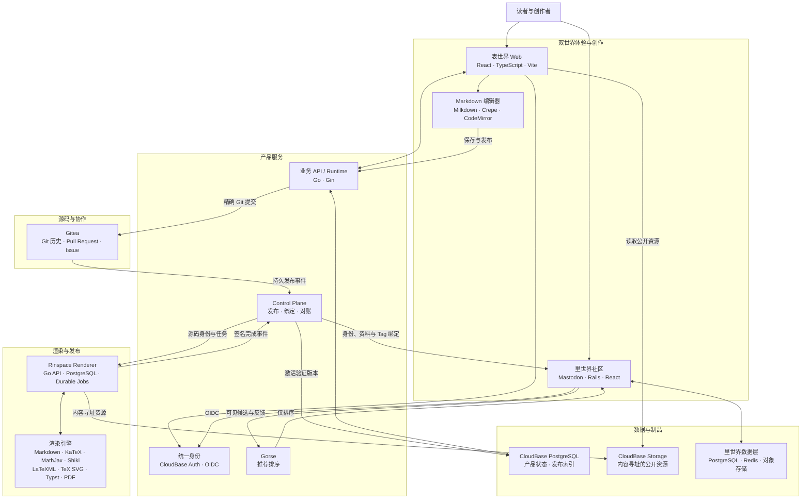

# 芥子环

[简体中文](README.md) | [English](README_EN.md)

芥子环是一个以 Tag 为核心的长文、知识与社区平台。我们以可追溯的源码和修订记录组织文章与书籍，并为 Markdown、LaTeX 和 Typst 提供创作、渲染与阅读能力。

- **官方网站：** [rinspace.com](https://rinspace.com)
- **开源项目：** [github.com/rinspacehq](https://github.com/rinspacehq)

## 项目

| 仓库 | 职责 | 当前版本 | 许可证 |
| --- | --- | --- | --- |
| [`rinspace-web`](https://github.com/rinspacehq/rinspace-web) | 芥子环 Web 前端，覆盖阅读、创作、Tag、个人资料与社区界面 | [`v0.2.3`](https://github.com/rinspacehq/rinspace-web/releases/tag/v0.2.3) | AGPL-3.0-only |
| [`rinspace-renderer`](https://github.com/rinspacehq/rinspace-renderer) | Markdown、LaTeX、Typst、图表与 PDF 的渲染协议及运行时 | [`v0.1.0-rc.2`](https://github.com/rinspacehq/rinspace-renderer/releases/tag/v0.1.0-rc.2) | AGPL-3.0-only |
| [`rinspace-editor-markdown`](https://github.com/rinspacehq/rinspace-editor-markdown) | 基于 Milkdown 和 Crepe 的 Markdown 编辑器 | [`v0.3.4`](https://github.com/rinspacehq/rinspace-editor-markdown/releases/tag/v0.3.4) | MIT |
| [`gitea`](https://github.com/rinspacehq/gitea) | 芥子环使用的 Gitea fork，承载内容源码与协作流程 | [`v1.27.2-rinspace.1`](https://github.com/rinspacehq/gitea/releases/tag/v1.27.2-rinspace.1) | MIT |
| [`mastodon`](https://github.com/rinspacehq/mastodon) | 芥子环里世界使用的 Mastodon fork | [`rinspace-2026.09.26.2`](https://github.com/rinspacehq/mastodon/releases/tag/rinspace-2026.09.26.2) | AGPL-3.0 |

## 架构概览

| 设计原则 | 实现方式 |
| --- | --- |
| 源码可追溯 | 长文以 Gitea 中的 Git 提交为权威源码，协作保留 Pull Request、Issue 和完整历史。 |
| 发布不可变 | 发布绑定精确提交和制品摘要；新版本验证失败时继续提供上一成功版本。 |
| 职责分离 | 产品服务负责业务与身份，Control Plane 负责编排，Renderer 通过独立引擎生成结果。 |
| 两个世界、一个身份 | 表世界承载知识内容，里世界承载本地社区；二者以稳定主体和 OIDC 连接。 |
| 明确事实来源 | Gitea 保存长文源码，Mastodon 保存社交关系与推文，Gorse 只对候选内容排序。 |

## 技术方向

芥子环将 Tag 视为具有稳定身份、上下文和生命周期的知识节点。长文源码与历史由 Git 保存，发布过程绑定精确提交；Control Plane 验证源码和任务身份，Renderer 生成不可变结果，验证通过后再由 Web 提供阅读。

公开组件以固定版本和完整性摘要进入芥子环产品。Renderer 同时支持独立本地运行和 Control Plane 集成，使公开实现与产品使用保持同一条版本链路。

当前工作集中在以下方向：

- 完善 Tag、文章、书籍与社区关系组成的知识网络。
- 提升 Markdown、LaTeX 和 Typst 从创作到发布的统一体验。
- 忠实呈现数学公式、参考文献、图表、SVG 与长文结构。
- 改进公开组件的可复现构建、稳定发行和独立部署能力。
- 按清晰的模块边界逐步开放更多芥子环组件。

## 当前能力与边界

| 领域 | 当前状态 |
| --- | --- |
| LaTeX | 以 LaTeXML 生成结构化 HTML；无法可靠转换的文档提供原 PDF 直接阅读。 |
| Typst | 支持 HTML 与 PDF 渲染。HTML 能力受官方 `typst2html` 限制，复杂绘图以 PDF 结果为准。 |
| Markdown | 编辑器 `v0.3.4` 已支持将 VS Code 源码粘贴为代码块，并修复首行 `#` 被识别为标题的问题；其他来源的粘贴兼容性仍在持续完善。 |
| 自托管 | Renderer 和 Markdown 编辑器可以独立使用；完整站点所需的后端、Control Plane 与生产部署系统尚未全部公开。 |

## 社区贡献

下表记录已经合入并进入发行版本的社区贡献。日期为贡献合入日期。

| 日期 | 贡献者 | 项目 | 已采纳内容 | 进入版本 |
| --- | --- | --- | --- | --- |
| 2026-10-03 | [`@xjn2005`](https://github.com/xjn2005) | [`rinspace-web` #25](https://github.com/rinspacehq/rinspace-web/pull/25) | 改进个人资料页布局和深色模式简介展示；增加个人网站链接；补充相应测试 | `v0.2.2`，延续至 `v0.2.3` |
| 2026-10-09 | [`@xjn2005`](https://github.com/xjn2005) | [`rinspace-editor-markdown` #13](https://github.com/rinspacehq/rinspace-editor-markdown/pull/13) | 支持 VS Code 源码粘贴为代码块；修复演示图片地址；更新依赖 | `v0.3.4` |

感谢所有提交代码、测试、问题复现、翻译和设计反馈的贡献者。各项目的发行说明会继续记录贡献实际进入的版本与范围。

## 参与项目

| 方向 | 入口 |
| --- | --- |
| Web 界面与浏览器行为 | [`rinspace-web/issues`](https://github.com/rinspacehq/rinspace-web/issues) |
| 渲染协议、引擎与部署 | [`rinspace-renderer/issues`](https://github.com/rinspacehq/rinspace-renderer/issues) |
| Markdown 编辑器 | [`rinspace-editor-markdown/issues`](https://github.com/rinspacehq/rinspace-editor-markdown/issues) |
| 跨项目规划 | [`.github/issues`](https://github.com/rinspacehq/.github/issues) |

安全问题请使用对应仓库提供的私密漏洞报告渠道。

## 致谢

芥子环建立在自由软件社区长期维护的成果之上。感谢 [`Mastodon`](https://github.com/mastodon/mastodon)、[`Gitea`](https://github.com/go-gitea/gitea)、[`Milkdown`](https://github.com/Milkdown/milkdown)、[`Typst`](https://github.com/typst/typst)、[`LaTeXML`](https://github.com/brucemiller/LaTeXML)、[`CodeMirror`](https://github.com/codemirror) 和 [`KaTeX`](https://github.com/KaTeX/KaTeX) 的维护者与贡献者。

---

最后更新：2026-10-10
