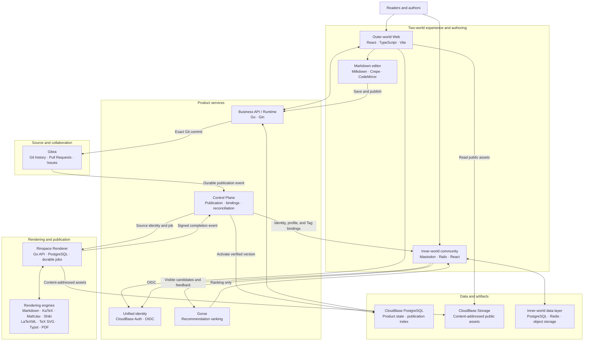

# Rinspace

[简体中文](README.md) | [English](README_EN.md)

Rinspace is a platform for long-form publishing, knowledge, and community, organized around Tags. Articles and books retain traceable source and revision histories, with authoring, rendering, and reading workflows for Markdown, LaTeX, and Typst.

- **Website:** [rinspace.com](https://rinspace.com)
- **Open source:** [github.com/rinspacehq](https://github.com/rinspacehq)

## Projects

| Repository | Role | Current version | License |
| --- | --- | --- | --- |
| [`rinspace-web`](https://github.com/rinspacehq/rinspace-web) | Web frontend for reading, authoring, Tags, profiles, and community features | [`v0.2.3`](https://github.com/rinspacehq/rinspace-web/releases/tag/v0.2.3) | AGPL-3.0-only |
| [`rinspace-renderer`](https://github.com/rinspacehq/rinspace-renderer) | Rendering protocol and runtime for Markdown, LaTeX, Typst, diagrams, and PDF | [`v0.1.0-rc.2`](https://github.com/rinspacehq/rinspace-renderer/releases/tag/v0.1.0-rc.2) | AGPL-3.0-only |
| [`rinspace-editor-markdown`](https://github.com/rinspacehq/rinspace-editor-markdown) | Markdown editor built with Milkdown and Crepe | [`v0.3.4`](https://github.com/rinspacehq/rinspace-editor-markdown/releases/tag/v0.3.4) | MIT |
| [`gitea`](https://github.com/rinspacehq/gitea) | Rinspace's Gitea fork for content source and collaboration workflows | [`v1.27.2-rinspace.1`](https://github.com/rinspacehq/gitea/releases/tag/v1.27.2-rinspace.1) | MIT |
| [`mastodon`](https://github.com/rinspacehq/mastodon) | Mastodon fork used by the Rinspace inner world | [`rinspace-2026.09.26.2`](https://github.com/rinspacehq/mastodon/releases/tag/rinspace-2026.09.26.2) | AGPL-3.0 |

## Architecture

| Design principle | Implementation |
| --- | --- |
| Traceable source | Long-form content uses Git commits in Gitea as its authoritative source, retaining Pull Requests, Issues, and complete history. |
| Immutable publication | A publication is bound to an exact commit and artifact digest. A failed candidate leaves the previous successful version active. |
| Separation of responsibilities | Product services own business and identity concerns, the Control Plane orchestrates work, and the Renderer produces results through isolated engines. |
| Two worlds, one identity | The outer world presents knowledge, while the inner world hosts the local community; stable subjects and OIDC connect them. |
| Explicit sources of truth | Gitea owns long-form source, Mastodon owns social relationships and posts, and Gorse ranks candidates without owning them. |

## Technical Direction

Rinspace treats a Tag as a knowledge node with a stable identity, context, and lifecycle. Git stores long-form sources and their history, and each publication is bound to an exact commit. The Control Plane verifies source and task identity, the Renderer produces an immutable result, and the Web serves the verified publication.

Public components enter the Rinspace product at pinned versions and integrity digests. The Renderer supports both standalone local operation and Control Plane integration, keeping the public implementation and production consumption on the same version chain.

Current work focuses on:

- Developing the knowledge network formed by Tags, articles, books, and community relationships.
- Unifying Markdown, LaTeX, and Typst authoring and publication workflows.
- Faithfully presenting mathematics, references, diagrams, SVG, and long-form document structure.
- Improving reproducible builds, stable releases, and standalone deployment of public components.
- Opening more Rinspace components along clearly defined module boundaries.

## Current Capabilities and Boundaries

| Area | Current status |
| --- | --- |
| LaTeX | LaTeXML generates structured HTML. Documents that cannot be converted reliably are available as the original PDF. |
| Typst | HTML and PDF rendering are supported. HTML output is limited by the official `typst2html` implementation; PDF remains the reference for complex diagrams. |
| Markdown | Editor `v0.3.4` supports pasting source from VS Code as a code block and preserves a leading `#` as code. Compatibility with other source applications continues to improve. |
| Self-hosting | The Renderer and Markdown editor can be used independently. The backend, Control Plane, and production deployment system required for the complete site are not yet fully public. |

## Community Contributions

This table records community work that has been merged and included in a release. Dates are merge dates.

| Date | Contributor | Project | Adopted contribution | Released in |
| --- | --- | --- | --- | --- |
| 2026-10-03 | [`@xjn2005`](https://github.com/xjn2005) | [`rinspace-web` #25](https://github.com/rinspacehq/rinspace-web/pull/25) | Improved the profile layout and dark-mode biography display, added personal website links, and added tests | `v0.2.2`, retained in `v0.2.3` |
| 2026-10-09 | [`@xjn2005`](https://github.com/xjn2005) | [`rinspace-editor-markdown` #13](https://github.com/rinspacehq/rinspace-editor-markdown/pull/13) | Added VS Code source paste handling, corrected demo image URLs, and updated dependencies | `v0.3.4` |

We thank everyone who contributes code, tests, reproducible reports, translations, and design feedback. Project release notes will continue to record the exact version and scope in which accepted work appears.

## Contributing

| Area | Entry point |
| --- | --- |
| Web interface and browser behavior | [`rinspace-web/issues`](https://github.com/rinspacehq/rinspace-web/issues) |
| Rendering protocols, engines, and deployment | [`rinspace-renderer/issues`](https://github.com/rinspacehq/rinspace-renderer/issues) |
| Markdown editor | [`rinspace-editor-markdown/issues`](https://github.com/rinspacehq/rinspace-editor-markdown/issues) |
| Cross-project planning | [`.github/issues`](https://github.com/rinspacehq/.github/issues) |

Please use the private vulnerability reporting channel provided by the relevant repository for security reports.

## Acknowledgements

Rinspace is built on free software maintained by communities around the world. We thank the maintainers and contributors of [`Mastodon`](https://github.com/mastodon/mastodon), [`Gitea`](https://github.com/go-gitea/gitea), [`Milkdown`](https://github.com/Milkdown/milkdown), [`Typst`](https://github.com/typst/typst), [`LaTeXML`](https://github.com/brucemiller/LaTeXML), [`CodeMirror`](https://github.com/codemirror), and [`KaTeX`](https://github.com/KaTeX/KaTeX).

---

Last updated: 2026-10-10
